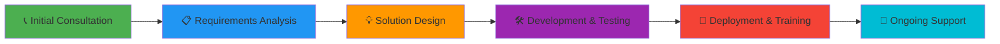

# 💼 Moses Kisya | Transforming Financial Management
### Full Stack Developer | IT Consultant | Founder of Kishea Technologies

### 🌍 Transforming Financial Management for Microfinances & Savings Groups
*Based in Uganda | Empowering Communities Through Technology*

---

## 🚀 **Introducing Save Circle - Now Available!**

### 💎 *The Complete Platform for Microfinances and Savings Groups*

**Save Circle** is a comprehensive financial management platform designed specifically for VSLAs, SACCOs, ROSCAs, and microfinance institutions. Built with cutting-edge technology, it streamlines operations and empowers your organization.

### ✅ **Key Features**

<table>
<tr>
<td width="50%">

- ✅ **Member Management**
  - Complete member profiles
  - Automated onboarding
  - Member analytics & reporting
  
- ✅ **Group Administration**
  - VSLAs, SACCOs, ROSCAs support
  - Multi-group management
  - Role-based access control

- ✅ **Loan Processing & Tracking**
  - Automated loan calculations
  - Payment schedules
  - Defaulter tracking

</td>
<td width="50%">

- ✅ **Emergency Loans via Mobile Money**
  - MTN Mobile Money integration
  - Airtel Money integration
  - Instant disbursement
  
- ✅ **Real-time Financial Reporting**
  - Transaction history
  - Financial statements
  - Custom reports & analytics

- ✅ **Secure Cloud Infrastructure**
  - Azure-hosted platform
  - Firebase real-time database
  - Bank-level security

</td>
</tr>
</table>

### 🛠️ **Tech Stack**

### 🎯 **Ready to Get Started?**

---

## 🌟 **Why Choose Me?**

### 🏆 Proven Expertise in Financial Technology

<table>
<tr>
<td width="50%">

**✨ Track Record of Success**
- 📱 **Cash Book App** - Live on Google Play Store
- 🏦 **SACCO Management Systems** - Hands-on implementation experience
- 🔄 **Data Migration Specialist** - Successfully migrated financial data for multiple institutions
- ☁️ **Cloud Infrastructure Expert** - Azure-certified solutions architect

</td>
<td width="50%">

**🌍 Uganda-Based Advantage**
- Deep understanding of local market dynamics
- Expert knowledge of mobile money ecosystems (MTN, Airtel)
- Insight into financial inclusion challenges in East Africa
- Culturally aligned solutions for community organizations

</td>
</tr>
</table>

### 💡 **What Sets Me Apart**

| Feature | Benefit |
|---------|---------|
| 🎯 **End-to-End Solutions** | From concept to deployment, training, and ongoing support |
| 🤝 **Client-Centric Approach** | Tailored solutions that meet your specific needs |
| 💯 **Proven Reliability** | Azure-hosted infrastructure with 99.9% uptime |
| 🔒 **Security First** | Bank-level security and data protection |
| ⚡ **Fast Delivery** | Agile development with quick turnaround times |
| 📈 **Scalable Architecture** | Solutions that grow with your organization |

---

## 💼 **Services Offered**

| Service | Description |
|---------|-------------|
| 💰 **Custom Financial Management Solutions** | Tailored platforms for SACCOs, VSLAs, and microfinances |
| 🏦 **SACCO/VSLA Digital Transformation** | Modernize your operations with cloud-based systems |
| 📱 **Mobile Money Integration** | Seamless MTN, Airtel, and other payment gateways |
| ☁️ **Cloud Infrastructure Setup** | Azure, Firebase, and scalable hosting solutions |
| 🎓 **IT Consultation & Training** | Expert guidance and team capacity building |
| 🔄 **Data Migration & System Integration** | Safe, secure transition from legacy systems |
| 📱 **Mobile App Development** | Cross-platform apps using Flutter & React Native |
| 🔧 **Ongoing Support & Maintenance** | 24/7 monitoring and technical support |

---

## 🛠️ **Technology Stack**

### Mobile Development

### Backend Development

### Cloud & Infrastructure

### Database & Analytics

### DevOps & Tools

---

## 📊 **GitHub Activity & Statistics**

---

## 🎯 **Featured Projects & Success Stories**

### 🌟 **Save Circle** - *Featured Platform*

**The complete solution for microfinances and savings groups**
- Full member and loan management system
- Mobile money integration (MTN, Airtel)
- Real-time financial reporting and analytics
- Cloud-based secure infrastructure

**📞 [Book a Demo Now](https://wa.me/256712415102?text=I%27d%20like%20to%20schedule%20a%20Save%20Circle%20demo)**

---

### 📱 **Cash Book App** - *Live on Google Play Store*

**A personal finance management powerhouse**
- Track income and expenses effortlessly
- Build better financial habits
- Real-time synchronization across devices
- Advanced analytics and insights

**[Download on Google Play Store →](https://play.google.com/store/apps/details?id=com.kishea.cashbook)**

---

### 🏦 **SACCO Management System Projects**

**Professional implementations for financial institutions**
- Data migration from legacy systems
- System integration and enhancement
- Data integrity and security implementations
- Member experience optimization
- Operational efficiency improvements

---

## 💯 **Trust Signals & Commitments**

| 🎯 Commitment | 🔒 Security | ⚡ Speed | 🤝 Support | 📈 Scalability |
|:---:|:---:|:---:|:---:|:---:|
| **Quality First** | **Secure & Compliant** | **Fast Turnaround** | **Ongoing Maintenance** | **Growth-Ready** |
| Rigorous testing | Bank-level encryption | Agile methodology | 24/7 monitoring | Cloud architecture |
| Code reviews | Data protection | Quick iterations | Technical support | Auto-scaling |
| Best practices | Compliance standards | Rapid deployment | Training included | Future-proof |

---

## 🤝 **Working With Me - Simple Process**

1. **📞 Initial Consultation** - Understand your needs and challenges (FREE)
2. **📋 Requirements Analysis** - Define scope, timeline, and deliverables
3. **💡 Solution Design** - Create tailored architecture and user experience
4. **🛠️ Development & Testing** - Build, test, and refine the solution
5. **🚀 Deployment & Training** - Launch and train your team
6. **🔧 Ongoing Support** - Continuous monitoring, updates, and assistance

---

## 👨‍💻 **About Me**

**Moses Kisya** - Full Stack Developer & IT Consultant with over a decade of professional experience transforming financial institutions through technology.

### 🎓 **Professional Background**
- **Education:** Software Engineering, Makerere University (Class of 2014)
- **Experience:** 10+ years in software development and IT consulting
- **Specialization:** Financial technology, mobile applications, cloud infrastructure
- **Location:** Uganda 🌍

### 🎯 **Mission**
Empowering communities and businesses through impactful, scalable technology solutions that solve real-world challenges while promoting responsible tech adoption and financial inclusion.

### 🌟 **Core Values**
- **Innovation:** Pushing boundaries with cutting-edge solutions
- **Quality:** Excellence in every line of code
- **Community:** Technology that serves and uplifts
- **Integrity:** Honest, transparent partnerships

### 🎵 **Beyond Code**
When I'm not coding, I'm creating music as a Christian gospel pianist 🎹 or exploring immersive gaming experiences 🎮 - both fuel my creativity and problem-solving skills.

---

## 🎯 **Ready to Transform Your Financial Institution?**

### **Let's Build Something Amazing Together!**

### **Get in Touch**

---

### 💼 **Next Steps to Get Started:**

1. **📞 Contact Me** - Reach out via WhatsApp, Email, or LinkedIn
2. **🗓️ Schedule a Call** - Book a free 30-minute consultation
3. **💡 Share Your Vision** - Tell me about your challenges and goals
4. **📋 Get a Proposal** - Receive a tailored solution and quote
5. **🚀 Launch Your Project** - Let's transform your organization together!

---

⭐ **Star this repository** if you appreciate my work!

💬 **Open to collaborations** - Let's explore innovative tech solutions together

🔄 **Always Learning** - Committed to staying at the forefront of technology

---

*Building the future of financial technology in Africa, one solution at a time.* 🌍✨

